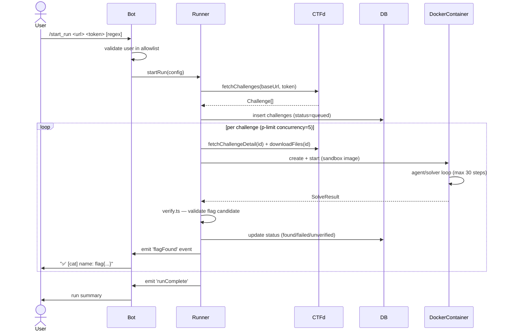
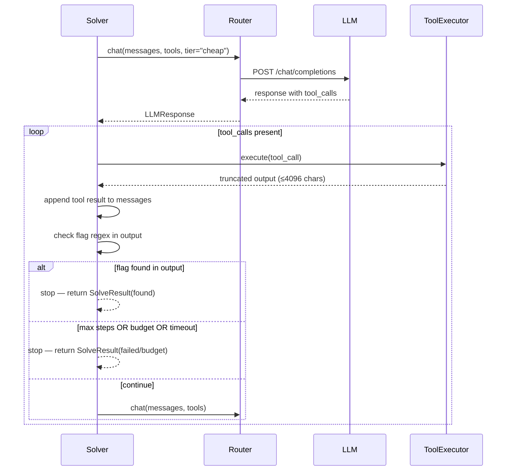

# Design Document: ctf-bot

## Overview

`ctf-bot` is a TypeScript/Node.js tool that autonomously attempts to solve CTFd-based CTF challenges using LLM agents operating inside isolated Docker containers. It is controlled through a Telegram bot and is designed strictly for flag *discovery* — it never submits flags to the CTF platform. Findings are reported back to authorised Telegram users in real time.

The system has two long-running processes managed by PM2: the Telegram bot (`bot.ts`) and the worker runner (`runner.ts`). They share a SQLite database for state and communicate via an in-process EventEmitter when co-located, or via DB polling when split across processes.

---

## Architecture

```mermaid
graph TD
    TG["Telegram User"] -->|commands| BOT["bot.ts\n(grammY)"]
    BOT -->|start_run / stop| RUNNER["runner.ts\n(p-limit worker pool)"]
    RUNNER -->|fetchChallenges| CTFD["platforms/ctfd.ts\n(read-only HTTP client)"]
    CTFD -->|writes files| WORKDIR["work/<id>/files/"]
    RUNNER -->|spin up| DOCKER["Docker container\n(solver sandbox)"]
    DOCKER -->|mounts read-only| WORKDIR
    DOCKER -->|runs| AGENT["agent/solver.ts\n(LLM loop)"]
    AGENT -->|chat()| ROUTER["providers/router.ts"]
    ROUTER -->|primary| AR["AgentRouter adapter"]
    ROUTER -->|fallback / escalate| OR["OpenRouter adapter"]
    AR & OR -->|OpenAI-compat API| LLMAPI["External LLM APIs"]
    AGENT -->|tool calls| TOOLS["run_shell / read_file\nwrite_file / http_request"]
    TOOLS -->|output| AGENT
    AGENT -->|SolveResult| VERIFY["verify.ts"]
    VERIFY -->|write status| DB["SQLite\n(better-sqlite3)"]
    DB -->|read| BOT
    VERIFY -->|emit flagFound| BOT
```

---

## Sequence Diagrams

### /start_run flow



### LLM agent tool-call loop



---

## Components and Interfaces

### Component 1: providers/

**Purpose**: Abstracts LLM API calls with concurrency control, retries, and spend caps.

**Interface**:
```typescript
// providers/types.ts

export interface ChatMessage {
  role: "system" | "user" | "assistant" | "tool";
  content: string;
  tool_call_id?: string;
  name?: string;
}

export interface ToolDefinition {
  type: "function";
  function: {
    name: string;
    description: string;
    parameters: Record<string, unknown>; // JSON Schema
  };
}

export interface ToolCall {
  id: string;
  type: "function";
  function: { name: string; arguments: string };
}

export interface ChatResponse {
  content: string | null;
  tool_calls: ToolCall[];
  usage: { prompt_tokens: number; completion_tokens: number; total_tokens: number };
  model: string;
}

export type Tier = "cheap" | "smart";

export interface ChatOptions {
  tier?: Tier;
  maxTokens?: number;
}

export interface LLMClient {
  chat(
    messages: ChatMessage[],
    tools: ToolDefinition[],
    options?: ChatOptions
  ): Promise<ChatResponse>;
}
```

**Responsibilities**:
- Define the `LLMClient` contract
- Provide `AgentRouterAdapter` and `OpenRouterAdapter` implementations
- `router.ts` selects provider, enforces per-provider concurrency via `p-limit`, retries on 429/5xx against the other provider, and tracks token spend against caps

---

### Component 2: platforms/ctfd.ts

**Purpose**: Read-only HTTP client for CTFd. No submit endpoint exists anywhere in the codebase.

**Interface**:
```typescript
export interface CTFdChallenge {
  id: number;
  name: string;
  category: string;
  value: number;
  solves: number;
  solved_by_me: boolean;
}

export interface CTFdChallengeDetail {
  id: number;
  name: string;
  category: string;
  description: string;
  value: number;
  connection_info: string | null; // "host:port" or URL
  files: string[];               // relative download paths
  hints: { id: number; cost: number }[];
  tags: string[];
}

export interface CTFdClient {
  fetchChallenges(): Promise<CTFdChallenge[]>;
  fetchChallengeDetail(id: number): Promise<CTFdChallengeDetail>;
  downloadFiles(id: number): Promise<string[]>; // returns local paths written
}

export function createCTFdClient(baseUrl: string, token: string): CTFdClient;
```

**Responsibilities**:
- Authenticated GET requests to CTFd API (`/api/v1/challenges`, `/api/v1/challenges/:id`)
- File download to `work/<id>/files/` (creates directory)
- Absolutely no POST/PUT to submit endpoints (enforced by code review + ESLint custom rule)

---

### Component 3: agent/solver.ts

**Purpose**: Orchestrates the LLM tool-call loop for a single challenge inside a Docker container.

**Interface**:
```typescript
// agent/types.ts

export interface ChallengeContext {
  challengeId: number;
  name: string;
  category: string;
  description: string;
  connectionInfo: string | null;
  localFilePaths: string[];
  flagRegex: RegExp;
  workDir: string; // /work inside container
}

export type StopReason =
  | "flag_found"
  | "max_steps"
  | "token_budget"
  | "wall_clock_timeout"
  | "error";

export interface SolveResult {
  challengeId: number;
  flagCandidate: string | null;
  evidence: string | null; // the exact command + output that produced the flag
  stepsUsed: number;
  tokensUsed: number;
  stopReason: StopReason;
  confidence: "high" | "medium" | "low" | "none";
}

export interface SolverConfig {
  maxSteps: number;           // default 30
  maxTokens: number;          // per-challenge budget
  wallClockTimeoutMs: number; // default 600_000 (10 min)
  outputTruncateChars: number; // default 4096
}

export interface AgentSolver {
  solve(context: ChallengeContext, config: SolverConfig): Promise<SolveResult>;
}
```

**Responsibilities**:
- Build system prompt from challenge context
- Execute the chat → tool_call → output → chat loop
- Enforce all stop conditions (flag found in tool output only, not model text)
- Truncate tool outputs before feeding back to LLM
- Return structured `SolveResult`

---

### Component 4: agent/tools.ts

**Purpose**: Implements the four tools available to the LLM agent inside the container.

**Interface**:
```typescript
export interface ToolExecutor {
  run_shell(cmd: string, timeoutMs?: number): Promise<string>;
  read_file(path: string): Promise<string>;
  write_file(path: string, content: string): Promise<void>;
  http_request(
    url: string,
    method: string,
    body?: string
  ): Promise<string>;
}

export function createToolExecutor(workDir: string): ToolExecutor;

export const TOOL_DEFINITIONS: ToolDefinition[]; // JSON Schema definitions for LLM
```

---

### Component 5: agent/container.ts

**Purpose**: Manages Docker container lifecycle for solver sandboxes via `dockerode`.

**Interface**:
```typescript
export interface ContainerConfig {
  challengeId: number;
  filesDir: string;       // host path to mount read-only
  workDir: string;        // /work inside container
  allowedHost: string | null; // for network restriction
  image: string;          // solver sandbox image name
}

export interface ManagedContainer {
  id: string;
  exec(cmd: string[], timeoutMs?: number): Promise<{ stdout: string; stderr: string; exitCode: number }>;
  stop(): Promise<void>;
  remove(): Promise<void>;
}

export async function createSolverContainer(
  config: ContainerConfig
): Promise<ManagedContainer>;
```

**Responsibilities**:
- Create container with: no Docker socket mount, non-root user (`ctf:ctf`, uid 1000), read-only bind mount of `filesDir` → `/work/files`, writable `/work/scratch` as tmpfs, network mode set to a per-challenge bridge with only `allowedHost` reachable (or no-network if null)
- Exec commands inside the running container
- Force-stop and remove on cancellation

---

### Component 6: runner.ts

**Purpose**: Worker pool that orchestrates the full lifecycle of a run.

**Interface**:
```typescript
export interface RunConfig {
  runId: string;
  ctfBaseUrl: string;
  ctfToken: string;
  flagRegex: string;
  concurrency: number; // default 5
  solverConfig: SolverConfig;
  spendCapUsd: number; // per-run LLM spend cap
}

export interface RunnerEvents {
  flagFound: (result: VerifiedResult) => void;
  challengeUpdate: (challengeId: number, status: ChallengeStatus) => void;
  runComplete: (summary: RunSummary) => void;
  error: (err: Error) => void;
}

export interface Runner extends EventEmitter {
  start(config: RunConfig): Promise<void>;
  stop(): Promise<void>;
  getStatus(): RunStatus;
}

export function createRunner(db: Database): Runner;
```

---

### Component 7: verify.ts

**Purpose**: Validates flag candidates before they are reported.

**Interface**:
```typescript
export interface VerifiedResult {
  challengeId: number;
  flag: string;
  evidence: string;
  verified: boolean; // true = regex match AND evidence contains flag
  reason?: string;   // why it failed verification
}

export function verifyFlag(
  result: SolveResult,
  flagRegex: RegExp
): VerifiedResult;
```

**Responsibilities**:
- Regex match: `flagRegex.test(flagCandidate)`
- Evidence check: `evidence.includes(flagCandidate)`
- Flags failing either check are marked `verified: false` and stored separately — never mixed with verified ones

---

### Component 8: bot.ts

**Purpose**: Telegram bot interface for controlling runs and receiving flag alerts.

**Interface**:
```typescript
// Command handlers (grammY)
// /start_run <url> <token> [regex]
// /status
// /flags
// /stop

export interface BotConfig {
  telegramToken: string;
  allowedUserIds: number[];
  runner: Runner;
  db: Database;
}

export function createBot(config: BotConfig): Bot; // grammY Bot instance
```

**Responsibilities**:
- Middleware: reject all updates from users not in `allowedUserIds`
- `/start_run`: parse args, validate, call `runner.start()`
- `/status`: query DB for queued/running/found/failed counts
- `/flags`: query DB, format verified flags with evidence snippet, show unverified separately
- `/stop`: call `runner.stop()`, report container kill counts
- Push notifications: listen to runner `flagFound` event, send formatted message immediately

---

## Data Models

### SQLite Schema

```typescript
// db/schema.ts

export interface RunRow {
  run_id: string;           // UUID
  ctf_base_url: string;
  flag_regex: string;
  status: "running" | "stopped" | "complete";
  started_at: number;       // Unix epoch ms
  stopped_at: number | null;
  spend_usd: number;        // running total
  spend_cap_usd: number;
}

export interface ChallengeRow {
  id: number;               // CTFd challenge ID
  run_id: string;
  name: string;
  category: string;
  description: string;
  connection_info: string | null;
  status: ChallengeStatus;
  flag_candidate: string | null;
  evidence: string | null;
  verified: number;         // 0 or 1 (SQLite boolean)
  steps_used: number | null;
  tokens_used: number | null;
  stop_reason: string | null;
  confidence: string | null;
  created_at: number;
  updated_at: number;
}

export type ChallengeStatus = "queued" | "running" | "found" | "failed" | "unverified";
```

### providers.json

```typescript
export interface ProviderConfig {
  id: string;               // "agent_router" | "open_router"
  baseUrl: string;
  apiKey: string;
  models: {
    cheap: string;          // e.g. "gpt-4o-mini"
    smart: string;          // e.g. "anthropic/claude-3-5-sonnet"
  };
  concurrencyLimit: number; // p-limit max concurrent calls
  maxRetriesOn429: number;
  spendCapUsd: number;      // per-provider per-run cap
}

// providers.json shape
export interface ProvidersConfig {
  providers: ProviderConfig[];
}
```

---

## Key Functions with Formal Specifications

### router.ts — `chat()`

```typescript
export async function chat(
  messages: ChatMessage[],
  tools: ToolDefinition[],
  options: ChatOptions & { runId: string }
): Promise<ChatResponse>
```

**Preconditions:**
- `messages` is non-empty with a valid `system` role first message
- `options.runId` exists in the DB with `status = "running"`
- Per-run spend has not exceeded `spendCapUsd`

**Postconditions:**
- Returns a valid `ChatResponse` with usage populated
- Spend counter for `runId` is incremented atomically
- If primary provider returns 429 or 5xx, exactly one retry against the secondary provider is attempted before throwing
- If `options.tier === "smart"` is passed, the `models.smart` model ID is used on both providers

**Error Behavior:**
- Throws `SpendCapExceededError` if budget would be exceeded before making the API call
- Throws `AllProvidersFailedError` if both providers return non-retryable errors

---

### solver.ts — `solve()`

```typescript
export async function solve(
  context: ChallengeContext,
  config: SolverConfig,
  llm: LLMClient,
  tools: ToolExecutor
): Promise<SolveResult>
```

**Preconditions:**
- `context.flagRegex` is a compiled, valid `RegExp`
- `config.maxSteps >= 1`
- Container is running and tools are operational

**Postconditions:**
- `result.stopReason` is always set
- If `result.flagCandidate !== null`, then `result.evidence !== null` and `context.flagRegex.test(result.flagCandidate) === true`
- Flag is detected only from tool output strings, never from model-generated `content`
- `result.stepsUsed <= config.maxSteps`
- `result.tokensUsed` reflects actual API usage for this challenge

**Loop Invariant:**
- At each step `i`, `messages` contains the complete conversation history up to step `i`
- `stepsUsed === i` at the start of iteration `i`

---

### verify.ts — `verifyFlag()`

```typescript
export function verifyFlag(result: SolveResult, flagRegex: RegExp): VerifiedResult
```

**Preconditions:**
- `flagRegex` is the same regex used during solving

**Postconditions:**
- `verified === true` iff `flagRegex.test(result.flagCandidate) && result.evidence.includes(result.flagCandidate)`
- When `verified === false`, `reason` explains which check failed
- No side effects — pure function

---

## Algorithmic Pseudocode

### Main Solver Loop

```typescript
async function solve(
  context: ChallengeContext,
  config: SolverConfig,
  llm: LLMClient,
  tools: ToolExecutor
): Promise<SolveResult> {
  const deadline = Date.now() + config.wallClockTimeoutMs;
  const messages: ChatMessage[] = [buildSystemPrompt(context)];
  let stepsUsed = 0;
  let totalTokens = 0;

  while (stepsUsed < config.maxSteps) {
    // Check wall-clock timeout
    if (Date.now() >= deadline) {
      return makeResult("wall_clock_timeout", null, null, stepsUsed, totalTokens);
    }

    // Check token budget
    if (totalTokens >= config.maxTokens) {
      return makeResult("token_budget", null, null, stepsUsed, totalTokens);
    }

    const response = await llm.chat(messages, TOOL_DEFINITIONS, {
      tier: stepsUsed > 15 ? "smart" : "cheap", // escalate after 15 failures
    });

    totalTokens += response.usage.total_tokens;
    messages.push({ role: "assistant", content: response.content, tool_calls: response.tool_calls });

    if (response.tool_calls.length === 0) {
      // Model responded with no tool call — nudge it or terminate
      stepsUsed++;
      continue;
    }

    for (const call of response.tool_calls) {
      const output = await executeToolCall(tools, call, config.outputTruncateChars);

      // CRITICAL: Only detect flag from tool output, never from model text
      const flagMatch = output.match(context.flagRegex);
      if (flagMatch) {
        return makeResult("flag_found", flagMatch[0], `${call.function.name}(${call.function.arguments})\n→ ${output}`, stepsUsed + 1, totalTokens);
      }

      messages.push({
        role: "tool",
        tool_call_id: call.id,
        content: output,
      });
    }

    stepsUsed++;
  }

  return makeResult("max_steps", null, null, stepsUsed, totalTokens);
}
```

### Router with Retry and Spend Cap

```typescript
async function chat(
  messages: ChatMessage[],
  tools: ToolDefinition[],
  options: ChatOptions & { runId: string }
): Promise<ChatResponse> {
  // Enforce spend cap before any call
  const currentSpend = db.getSpend(options.runId);
  if (currentSpend >= runConfig.spendCapUsd) {
    throw new SpendCapExceededError(options.runId);
  }

  const tier = options.tier ?? "cheap";
  const [primary, fallback] = selectProviders(); // based on load (p-limit slots)

  for (const provider of [primary, fallback]) {
    try {
      return await provider.limiter(async () => {
        const response = await callOpenAICompat(provider, messages, tools, tier);
        db.incrementSpend(options.runId, estimateCost(response.usage, provider));
        return response;
      });
    } catch (err) {
      if (isRetryable(err)) continue; // 429 or 5xx → try fallback
      throw err;
    }
  }

  throw new AllProvidersFailedError();
}
```

---

## Example Usage

```typescript
// Starting a run from bot command: /start_run https://ctf.example.com TOKEN123 flag\{.*\}

import { createRunner } from "./runner";
import { createCTFdClient } from "./platforms/ctfd";
import { openDb } from "./db";

const db = openDb("./ctfbot.db");
const runner = createRunner(db);

runner.on("flagFound", (result) => {
  bot.api.sendMessage(
    chatId,
    `✅ [${result.category}] ${result.name}: ${result.flag}\n` +
    `Evidence: ${result.evidence.slice(0, 120)}...`
  );
});

await runner.start({
  runId: crypto.randomUUID(),
  ctfBaseUrl: "https://ctf.example.com",
  ctfToken: "TOKEN123",
  flagRegex: "flag\\{.*?\\}",
  concurrency: 5,
  spendCapUsd: 10.00,
  solverConfig: {
    maxSteps: 30,
    maxTokens: 100_000,
    wallClockTimeoutMs: 600_000,
    outputTruncateChars: 4096,
  },
});
```

```typescript
// providers/router.ts — instantiation
import pLimit from "p-limit";
import { ProvidersConfig } from "./types";

const config: ProvidersConfig = JSON.parse(fs.readFileSync("providers.json", "utf8"));

const providers = config.providers.map((p) => ({
  ...p,
  limiter: pLimit(p.concurrencyLimit),
}));
```

```typescript
// agent/container.ts — creating a sandboxed container
const container = await createSolverContainer({
  challengeId: 42,
  filesDir: "/home/user/ctf-bot/work/42/files",
  workDir: "/work",
  allowedHost: "challenge.ctf.example.com",
  image: "ctf-bot-sandbox:latest",
});

// HostConfig used internally:
// {
//   Binds: ["/home/user/ctf-bot/work/42/files:/work/files:ro"],
//   NetworkMode: "ctf-challenge-42",  // isolated bridge
//   UsernsMode: "",
//   User: "1000:1000",
//   ReadonlyRootfs: false,
//   Tmpfs: { "/work/scratch": "rw,noexec,nosuid,size=256m" },
//   CapDrop: ["ALL"],
//   SecurityOpt: ["no-new-privileges"],
// }
```

---

## Correctness Properties

- **No-submit invariant**: No function in the codebase has a code path that calls a CTFd `/api/v1/challenges/:id/attempt` or any submit-like endpoint. Enforced by ESLint `no-restricted-syntax` rule targeting fetch/axios calls to `/attempt`.
- **Flag-in-evidence**: `∀ r: SolveResult where r.flagCandidate ≠ null → r.evidence.includes(r.flagCandidate)`
- **Tool-only flag detection**: The flag regex is only applied against tool output strings. The `response.content` field from the LLM is never scanned for flags.
- **Verified/unverified separation**: `∀ r: VerifiedResult where r.verified = false → r` is never included in the `/flags` verified list.
- **Allowlist enforcement**: Every grammY update passes through middleware that checks `ctx.from.id ∈ allowedUserIds` before any handler runs.
- **Container isolation**: Containers are created with `User: "1000:1000"`, `CapDrop: ["ALL"]`, no Docker socket mount, and bind mounts are read-only for challenge files.
- **Spend cap enforcement**: Token spend is checked atomically in the router *before* each API call. A `SpendCapExceededError` is thrown if the cap is reached, stopping further calls for that run.

---

## Error Handling

### Scenario 1: LLM Provider 429 Rate Limit

**Condition**: Primary provider returns HTTP 429
**Response**: Router catches the error, immediately routes the same call to the fallback provider using its concurrency limiter
**Recovery**: If fallback also returns 429 or 5xx, throws `AllProvidersFailedError`; solver catches this and records `stopReason: "error"`

### Scenario 2: Docker Container Crash

**Condition**: Container exits unexpectedly during solver execution
**Response**: `dockerode` exec returns non-zero exit code or throws; `container.exec()` surfaces the error to solver
**Recovery**: Solver catches, sets `stopReason: "error"`, runner marks challenge as `failed` in DB, container is removed

### Scenario 3: CTFd API Unreachable

**Condition**: `fetchChallenges()` or `fetchChallengeDetail()` throws a network error
**Response**: Error propagates to runner; run is aborted with descriptive message
**Recovery**: Runner emits `error` event; bot sends error message to user; run status set to `stopped`

### Scenario 4: Spend Cap Exceeded

**Condition**: Per-run LLM spend reaches `spendCapUsd`
**Response**: Router throws `SpendCapExceededError` before making any API call
**Recovery**: Runner catches, stops accepting new challenges, marks in-flight ones as `failed`, emits `runComplete` with spend summary

### Scenario 5: /stop Command

**Condition**: User sends `/stop` to the bot
**Response**: Runner calls `stop()`, which calls `runner.p-limit.clearQueue()` and then `container.stop()` on all active containers
**Recovery**: All containers force-killed (`SIGKILL` after 5s grace), statuses updated to `failed`, run marked `stopped`

---

## Testing Strategy

### Unit Testing Approach

Use **Vitest** (or Jest) for unit tests:
- `providers/`: mock HTTP calls with `msw` or `nock`; test retry logic, spend cap enforcement, tier selection
- `verify.ts`: property-based tests — any result with a flag not present in evidence must return `verified: false`
- `platforms/ctfd.ts`: mock CTFd API responses; assert no POST calls are ever made
- `agent/solver.ts`: mock `LLMClient` and `ToolExecutor`; test all stop conditions independently

### Property-Based Testing Approach

Use **fast-check** for property tests:

**Property Test Library**: `fast-check`

Key properties:
- `verifyFlag`: for any `SolveResult` where `evidence` does not contain `flagCandidate`, `verified` must be `false`
- `router.chat()`: for any sequence of 429 responses from primary, exactly one retry against secondary is made
- `solver`: `stepsUsed` never exceeds `config.maxSteps` regardless of LLM response shape

### Integration Testing Approach

- Spin up a local CTFd instance (Docker Compose) with a seeded easy challenge
- Run the full stack against it end-to-end
- Assert: flag found, stored in DB as `verified`, bot notification triggered, no submit calls made (verified via HTTP intercept)

---

## Performance Considerations

- `p-limit(5)` default concurrency balances API rate limits vs. throughput; configurable per run
- Tool output truncated to 4096 chars before feeding back to LLM to manage context window growth
- After step 15, the solver escalates to the `smart` (more capable) model tier to avoid infinite cheap-model loops
- SQLite with WAL mode for concurrent reads from bot while runner writes
- Container creation is the main latency bottleneck; pre-pulling the image at startup mitigates cold-start delay
- Docker containers use tmpfs for `/work/scratch` to avoid I/O bottlenecks on disk-heavy challenges

---

## Security Considerations

- **No-submit enforcement**: ESLint custom rule + code review gate; no submit function anywhere
- **Container isolation**: non-root user, all Linux capabilities dropped, no Docker socket, read-only challenge files, tmpfs scratch space, per-challenge network bridge
- **Secret isolation**: `providers.json` (containing API keys) is never mounted or accessible inside solver containers
- **Telegram allowlist**: `allowedUserIds` checked in middleware before any handler; not just at command entry points
- **Per-run spend cap**: prevents runaway LLM costs from a misbehaving agent or infinite loop
- **Network restriction**: solver containers only reach the challenge's declared `connection_info` host; no outbound internet for unrelated traffic
- **Input sanitisation**: CTFd API responses are parsed with a schema validator (Zod) before use to prevent prompt injection via malicious challenge descriptions

---

## Dependencies

| Package | Version | Purpose |
|---|---|---|
| `grammy` | `^1.x` | Telegram bot framework |
| `dockerode` | `^4.x` | Docker container management |
| `better-sqlite3` | `^9.x` | SQLite database |
| `p-limit` | `^5.x` | Concurrency control |
| `zod` | `^3.x` | Runtime schema validation |
| `typescript` | `^5.x` | Language |
| `tsx` | `^4.x` | TS execution for dev |
| `pm2` | `^5.x` | Process management |
| `vitest` | `^1.x` | Test runner |
| `fast-check` | `^3.x` | Property-based testing |
| `msw` | `^2.x` | HTTP mocking for tests |

---

## Project Structure

```
ctf-bot/
├── src/
│   ├── providers/
│   │   ├── types.ts           # LLMClient interface, ChatMessage, etc.
│   │   ├── agent-router.ts    # AgentRouter adapter
│   │   ├── open-router.ts     # OpenRouter adapter
│   │   └── router.ts          # Provider selection, retry, spend cap
│   ├── platforms/
│   │   └── ctfd.ts            # Read-only CTFd client
│   ├── agent/
│   │   ├── types.ts           # ChallengeContext, SolveResult, etc.
│   │   ├── solver.ts          # LLM loop
│   │   ├── tools.ts           # run_shell, read_file, write_file, http_request
│   │   ├── container.ts       # Docker container lifecycle
│   │   └── prompts.ts         # System prompt builder
│   ├── db/
│   │   ├── schema.ts          # Type definitions for DB rows
│   │   └── index.ts           # openDb(), query helpers
│   ├── verify.ts
│   ├── runner.ts
│   └── bot.ts
├── sandbox/
│   └── Dockerfile             # Solver sandbox image
├── config/
│   └── providers.json         # API keys, model IDs, concurrency (gitignored)
├── work/                      # Challenge working directories (gitignored)
├── ecosystem.config.js        # PM2 config
├── package.json
├── tsconfig.json
└── .eslintrc.json             # Includes no-submit custom rule
```

---

## Docker Sandbox Image

```dockerfile
# sandbox/Dockerfile
FROM ubuntu:24.04

RUN apt-get update && apt-get install -y --no-install-recommends \
    python3 python3-pip python3-dev \
    binwalk exiftool curl file netcat-openbsd \
    build-essential git \
    && pip3 install --break-system-packages pwntools \
    && apt-get clean

# Create non-root user
RUN groupadd -g 1000 ctf && useradd -u 1000 -g 1000 -m ctf

WORKDIR /work
USER ctf
```

---

## PM2 Ecosystem

```javascript
// ecosystem.config.js
module.exports = {
  apps: [
    {
      name: "ctf-bot",
      script: "src/bot.ts",
      interpreter: "node",
      interpreter_args: "--import tsx",
      env: { NODE_ENV: "production" },
    },
    {
      name: "ctf-runner",
      script: "src/runner.ts",
      interpreter: "node",
      interpreter_args: "--import tsx",
      env: { NODE_ENV: "production" },
    },
  ],
};
```
